```
## ── Attaching packages ────────────────────────────────────────── tidyverse 1.2.1 ──
```

```
## ✔ ggplot2 2.2.1     ✔ purrr   0.2.4
## ✔ tibble  1.4.2     ✔ dplyr   0.7.4
## ✔ tidyr   0.8.0     ✔ stringr 1.3.0
## ✔ readr   1.1.1     ✔ forcats 0.3.0
```

```
## ── Conflicts ───────────────────────────────────────────── tidyverse_conflicts() ──
## ✖ dplyr::filter() masks stats::filter()
## ✖ dplyr::lag()    masks stats::lag()
```

```
## Parsed with column specification:
## cols(
##   .default = col_double(),
##   shelf = col_character(),
##   flat = col_integer(),
##   col = col_character(),
##   row = col_integer(),
##   acs = col_character(),
##   trt = col_character(),
##   days = col_integer(),
##   date = col_character(),
##   leafnum = col_integer(),
##   ndvi = col_integer(),
##   alt = col_integer(),
##   species = col_character(),
##   who = col_character()
## )
```

```
## See spec(...) for full column specifications.
```

```
## # A tibble: 6 x 23
##   shelf  flat col     row acs   trt    days date    hyp  int1   int2  int3
##   <chr> <int> <chr> <int> <chr> <chr> <int> <chr> <dbl> <dbl>  <dbl> <dbl>
## 1 Z         1 B         1 LA25… H        28 5/5/…  19.5 2.37  1.59    1.87
## 2 Z         1 C         1 LA13… H        28 5/5/…  31.3 3.34  0.0100  9.19
## 3 Z         1 D         1 LA19… H        28 5/5/…  56.6 8.43  2.39    6.70
## 4 Z         1 E         1 LA27… H        28 5/5/…  35.2 0.560 0.      1.60
## 5 Z         1 F         1 LA29… H        28 5/5/…  35.3 0.820 0.0200  1.49
## 6 Z         1 G         1 LA13… H        28 5/5/…  28.7 1.07  6.69    5.72
## # ... with 11 more variables: int4 <dbl>, petleng <dbl>, leafleng <dbl>,
## #   leafwid <dbl>, leafnum <int>, ndvi <int>, lat <dbl>, lon <dbl>,
## #   alt <int>, species <chr>, who <chr>
```

see the species names:

```r
unique(tomato$species)
```

```
## [1] "S. pennellii"    "S. peruvianum"   "S. chilense"     "S. chmielewskii"
## [5] "S. habrochaites"
```

#### Aesthetic
`color`:  
1. plot petleng against leafleng(scatterplot)
2. color the point by treatment, L or H

```r
tomato %>% ggplot(mapping = aes(x=petleng, y=leafleng, color = trt)) + 
  geom_point()
```

```
## Warning: Removed 2 rows containing missing values (geom_point).
```

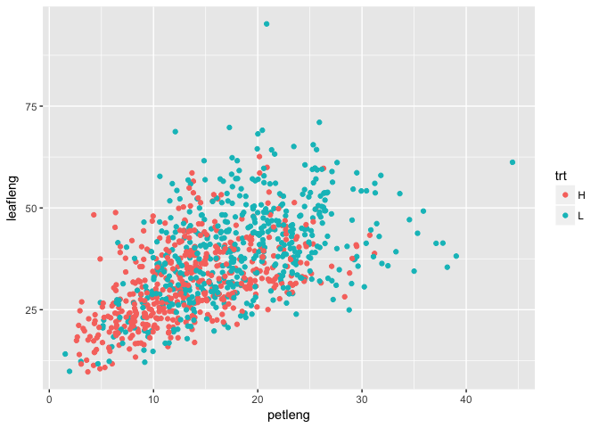<!-- -->

`shape`: control the shape of plotted points.  
`fill` : control the color fill of the shape  

Create a plot of int3 vs int4 where color indicates __trt__, and shape indicates __who__ measured the plant.  

```r
tomato %>% ggplot(aes(x = int3, y = int4, color = trt, shape = who)) +
           geom_point()
```

```
## Warning: Removed 102 rows containing missing values (geom_point).
```

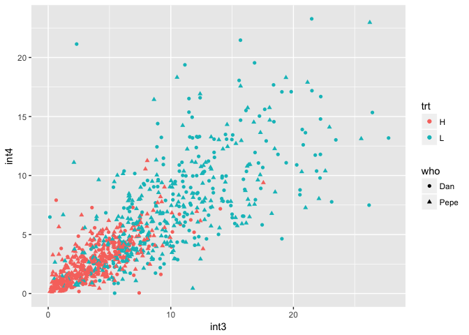<!-- -->

`size`: control the size of the plotted point  
create a plot of latitude vs longitude where altitude is indicated by the size of the point and species is indicated by color  

```r
tomato %>% ggplot(aes(x=lat, y=lon, size = alt, color = species)) + geom_point()
```

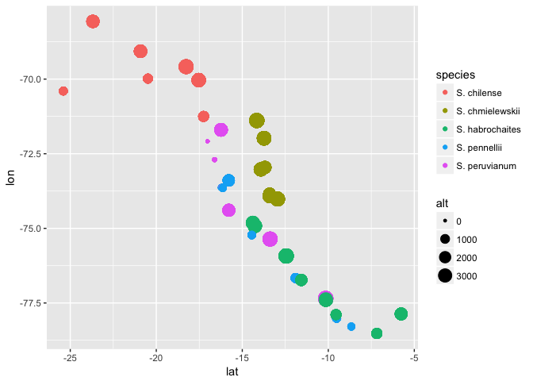<!-- -->

#### change plot setting without refering to the cols  
change dots color to skyblue

```r
tomato %>% ggplot(mapping = aes(x=petleng,y=leafleng)) +
  geom_point(color="skyblue") # change in the geom function
```

```
## Warning: Removed 2 rows containing missing values (geom_point).
```

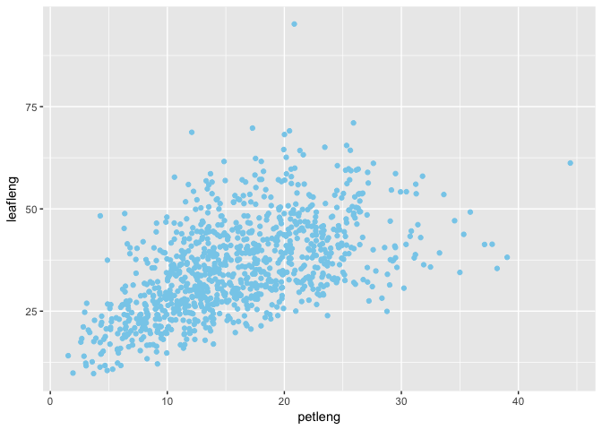<!-- -->

`shape`: The different plotting shapes are numbered from __0 to 25__  

```r
tomato %>% ggplot(mapping = aes(x=petleng,y=leafleng)) +
  geom_point(color="skyblue", shape = 2) # triangle
```

```
## Warning: Removed 2 rows containing missing values (geom_point).
```

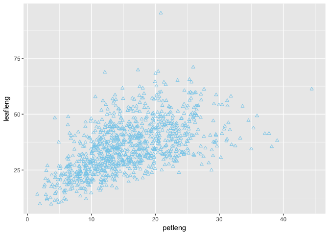<!-- -->

#### Geom() control the type of plot that is made.  
* `Geom_smooth()` : add trend lines to your plots  

```r
tomato %>% ggplot(aes(x=lon, y = lat)) + 
  geom_smooth() # only add trendlines, no scatter points; if not specified, it will use geom_smooth(method = "gam")
```

```
## `geom_smooth()` using method = 'gam'
```

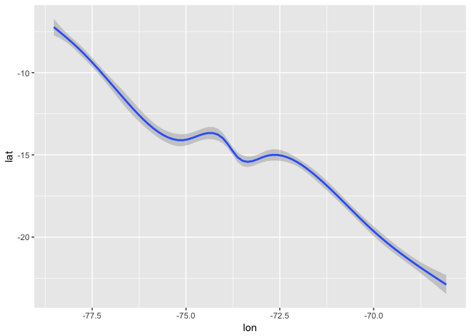<!-- -->

* we can add multiple geom to a plot 
example: trendline + scatter plot

```r
tomato %>% ggplot(aes(x=lon, y = lat)) + 
  geom_smooth() +
  geom_point()
```

```
## `geom_smooth()` using method = 'gam'
```

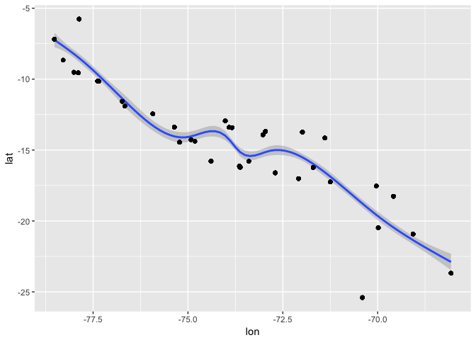<!-- -->

* add linear regress best fit line to the plot:  

```r
tomato %>% ggplot(aes(x=lon, y = lat)) + 
  geom_smooth(method="lm") + # linear model
  geom_point()
```

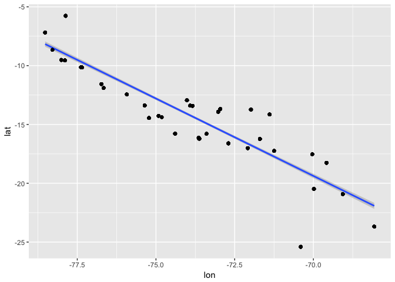<!-- -->

* `geom_histogram()` and `geom_density()`: create histograms, only take x value, y value is calculated for you  

```r
tomato %>% ggplot(aes(x=hyp)) +
  geom_histogram(binwidth = 5)
```

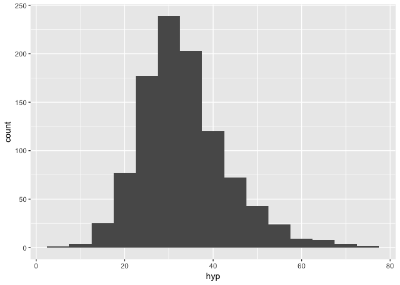<!-- -->

`fill` use control the color used to fill the bars  

```r
tomato %>% ggplot(aes(x=hyp)) +
  geom_histogram(fill="red")
```

```
## `stat_bin()` using `bins = 30`. Pick better value with `binwidth`.
```

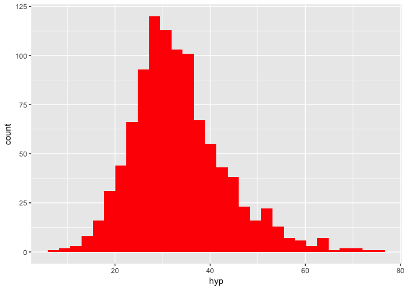<!-- -->

`geom_density`  

```r
tomato %>% ggplot(aes(x=hyp)) + 
geom_density()
```

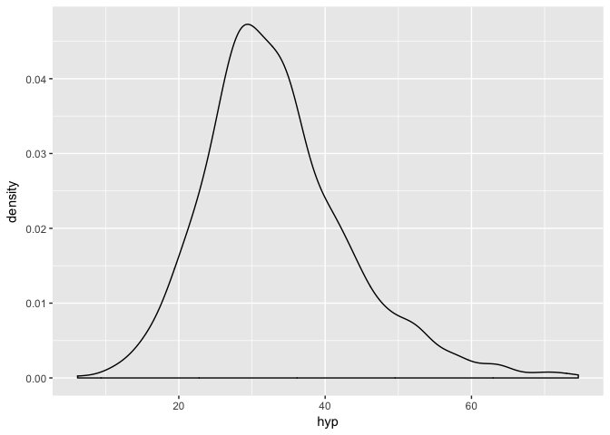<!-- -->

density plot allows comparision between two density:  

```r
tomato %>% ggplot(aes(x=hyp, fill=trt)) +
  geom_density(alpha=.5) # alpha value change the color density 0-1, low to high
```

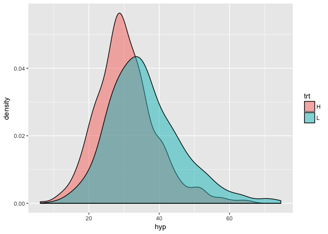<!-- -->

* `geom_boxplot()` and `geom_violin()`: provide quick summaries of different classes of data  
examine hypocotyl length(hyp) of each species. We can map hypocotyl length to the y-axis and species to the x-axis

```r
tomato %>% ggplot(aes(x=species, y=hyp)) +
  geom_boxplot()
```

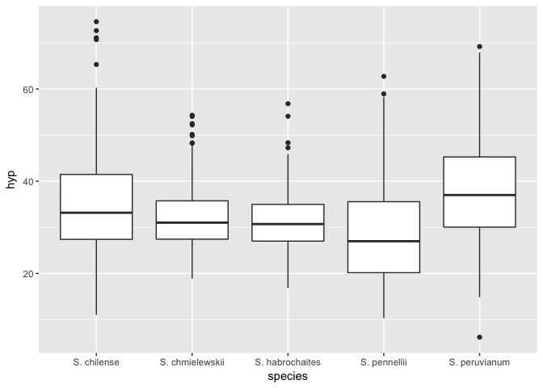<!-- -->


```r
tomato %>% ggplot(aes(x=species, y=hyp)) +
  geom_violin()
```

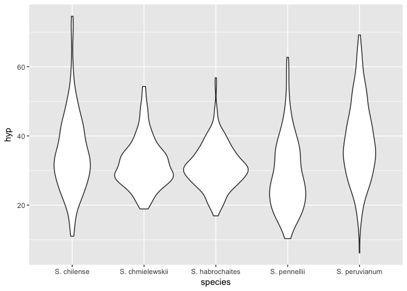<!-- -->

Make a boxplot showing hypocotyl length for the “H” and “L” treatments

```r
tomato %>% ggplot(aes(x=trt, y=hyp)) +
  geom_violin() 
```

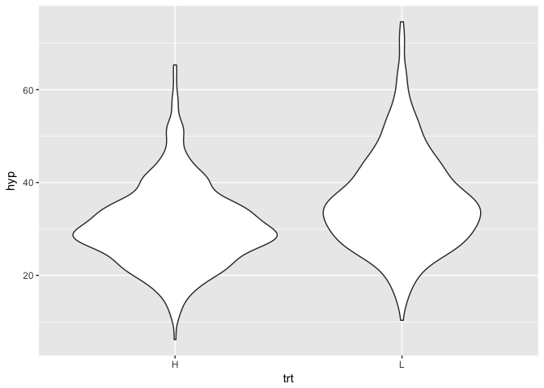<!-- -->


```r
tomato %>% ggplot(aes(x=species, y=int3, fill = trt)) +
  geom_boxplot()
```

```
## Warning: Removed 4 rows containing non-finite values (stat_boxplot).
```

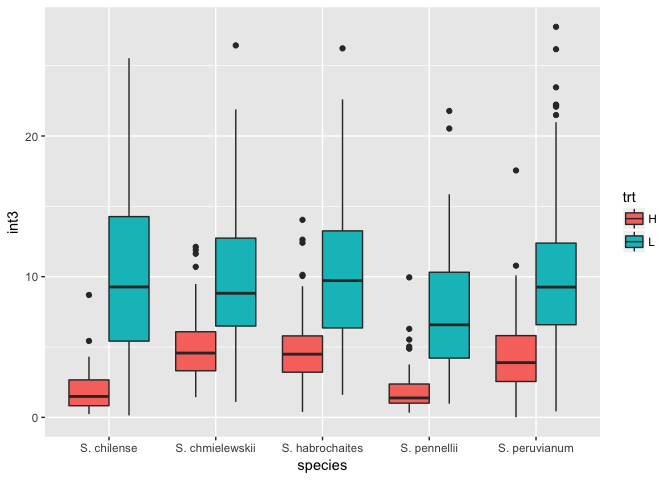<!-- -->

* `geom_col(): make a classic __bar chart__, where the height of the bars corresponds to some value in the data  

1. summarize the data  

```r
# write a function to calculate sample mean error (SE)
sem <- function(x, na.rm=FALSE) { # by default na.rm = FALSE
  sd(x,na.rm=na.rm)/sqrt(length(na.omit(x)))
}

int3.mean.sem <- tomato %>%
  group_by(species, trt) %>%
  summarize(mean=mean(int3, na.rm=TRUE), sem=sem(int3, na.rm=TRUE))

int3.mean.sem
```

```
## # A tibble: 10 x 4
## # Groups:   species [?]
##    species         trt    mean   sem
##    <chr>           <chr> <dbl> <dbl>
##  1 S. chilense     H      1.80 0.133
##  2 S. chilense     L     10.1  0.568
##  3 S. chmielewskii H      4.87 0.221
##  4 S. chmielewskii L      9.91 0.462
##  5 S. habrochaites H      4.89 0.215
##  6 S. habrochaites L     10.1  0.456
##  7 S. pennellii    H      1.96 0.219
##  8 S. pennellii    L      7.52 0.533
##  9 S. peruvianum   H      4.25 0.269
## 10 S. peruvianum   L     10.2  0.538
```

2. Plot the __bar plot__ for int3 mean across species and treatment  

```r
int3.mean.sem %>% ggplot(aes(x=species, y = mean, fill=trt)) +
  geom_col(position="dodge") # plot bar bins side by side instead of stacking up
```

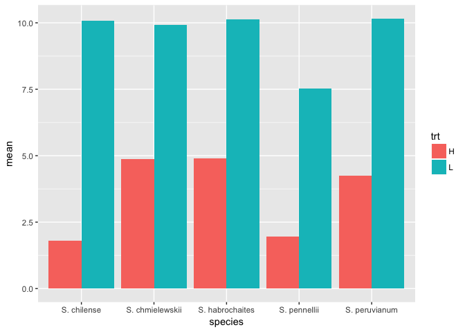<!-- -->

3. Add error bar  

```r
int3.mean.sem %>% ggplot(aes(x=species, 
                             y = mean, 
                             fill=trt, 
                             ymax=mean+sem, 
                             ymin=mean-sem)) +
  geom_col(position="dodge") +
  geom_errorbar(position = position_dodge(width=0.9), width=.5)
```

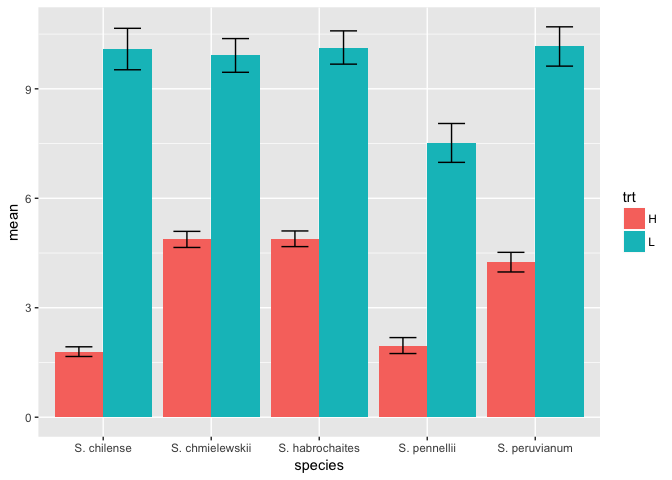<!-- -->

Example: Make a bar chart that shows __average leaf length__ for each accession (acs) and trt combination.  

```r
# calculate average leaf length for each combination:
leaf.mean.sem <- tomato %>%
  group_by(acs, trt) %>%
  summarize(mean=mean(int3, na.rm=TRUE), sem=sem(int3, na.rm=TRUE))
leaf.mean.sem
```

```
## # A tibble: 72 x 4
## # Groups:   acs [?]
##    acs    trt    mean   sem
##    <chr>  <chr> <dbl> <dbl>
##  1 LA1028 H      4.72 0.564
##  2 LA1028 L      6.97 0.642
##  3 LA1305 H      5.33 0.743
##  4 LA1305 L     11.5  2.05 
##  5 LA1306 H      3.93 0.283
##  6 LA1306 L     11.8  0.899
##  7 LA1316 H      3.55 0.383
##  8 LA1316 L      7.68 0.747
##  9 LA1317 H      7.69 0.618
## 10 LA1317 L     15.4  1.29 
## # ... with 62 more rows
```

```r
# plot 
leaf.mean.sem %>% ggplot(aes(x=acs, 
                              y = mean, 
                              fill = trt,
                              ymax = mean+sem,
                              ymin = mean-sem)) +  
                              geom_col(position="dodge") +
  geom_errorbar(position = position_dodge(width=0.9), width=.5)
```

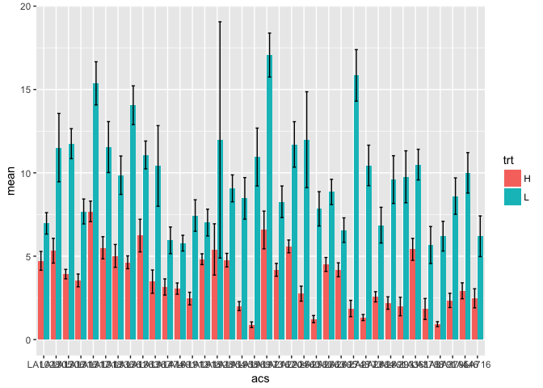<!-- -->

* `geom_line()`: data appropriate for bar charts also can be plotted using lines  

```r
int3.mean.sem %>% ggplot(aes(x=species,
                             y=mean,
                             color=trt,
                             group=trt,
                             shape=trt,
                             ymax=mean+sem,
                             ymin=mean-sem)) +
  geom_line() +
  geom_errorbar(width=.1) +
  geom_point()
```

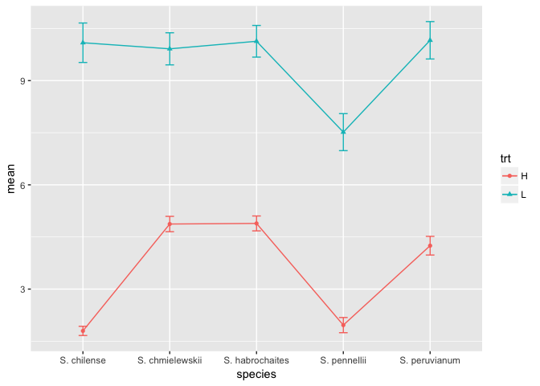<!-- -->

however, plotting each species’ reaction to the treatment would make more sense:  

```r
int3.mean.sem %>% ggplot(aes(x = trt, 
                             y = mean, 
                             color = species, 
                             group = species, 
                             shape = species)) + geom_line() + geom_point()
```

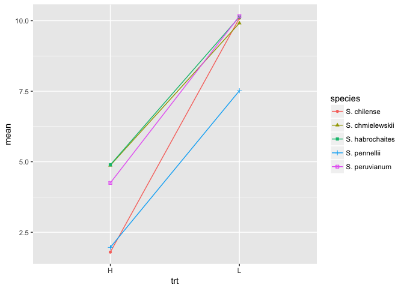<!-- -->

#### Scale() functions  
* we want to fill the bar manually with different colors  

```r
int3.mean.sem %>% ggplot(aes(x=species, y = mean, fill=trt, ymax=mean+sem, ymin=mean-sem)) +
  geom_col(position="dodge") +
  geom_errorbar(position = position_dodge(width=0.9), width=.5) +
  scale_fill_manual(values = c("H"="#999999","L"="#E69F00")) # plus this command
```

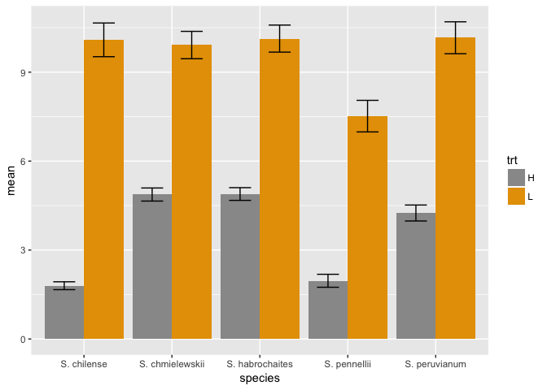<!-- -->

* a particular useful one to transform x or y to log scale:  
`scale_y_log10()` and `scale_x_log10()`  

#### Facets 
Previous method: the code below separates the data into “H” and “L” treatments before making the density plot.


```r
tomato %>% ggplot(aes(x=int3, fill=trt)) +
  geom_density(alpha=.5)
```

```
## Warning: Removed 4 rows containing non-finite values (stat_density).
```

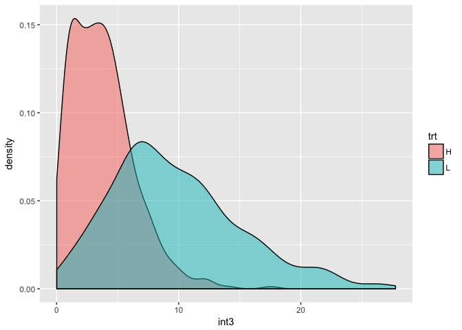<!-- -->

Another way to do this: `facet_wrap()` or `facet_grid()`  
`facet_wrap()` separate two densities into two graphs (in a row)  

```r
tomato %>% ggplot(aes(x=int3)) +
  geom_density(fill="lightblue") +
  facet_wrap(~ trt) # separate by treatment L and H
```

```
## Warning: Removed 4 rows containing non-finite values (stat_density).
```

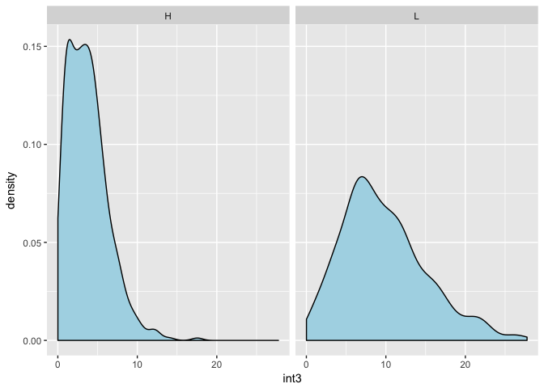<!-- -->

modify the code above to separate two densities in two rows: 

```r
tomato %>% ggplot(aes(x=hyp)) +
  geom_density(fill="papayawhip") +
  facet_wrap(~ trt, nrow = 2) # specify by nrow = , ncol= ,
```

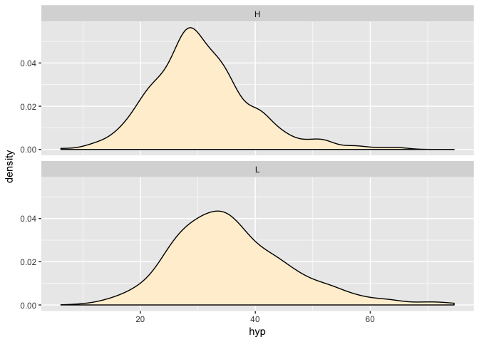<!-- -->

`facet_grid()` can use __two variables__ to facet and uses those variable to specify the grid of rows and columns:

```r
# separate variables in int3 
tomato %>% ggplot(aes(x=int3)) +
  geom_histogram(fill="lawngreen") +
  facet_grid(who ~ trt) + # specify which two variables you want to separate in int3, order matters here, 
  ylim(0,40) # change the y scale limit, or xlim()
```

```
## `stat_bin()` using `bins = 30`. Pick better value with `binwidth`.
```

```
## Warning: Removed 4 rows containing non-finite values (stat_bin).
```

```
## Warning: Removed 3 rows containing missing values (geom_bar).
```

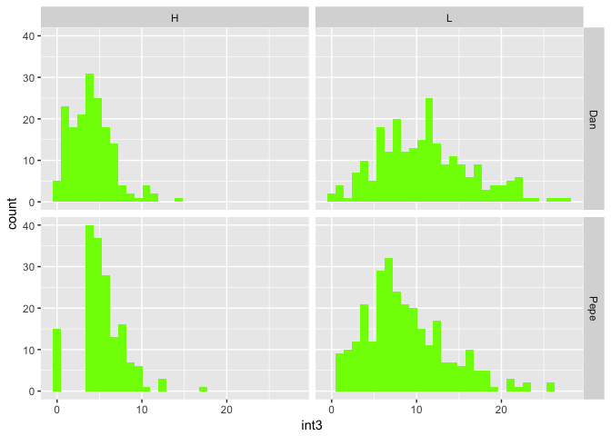<!-- -->

* Titles and labels  

```r
tomato %>% ggplot(aes(x=species,y=int3,fill=trt)) +
  geom_boxplot() +
  ggtitle("Tomato") + # add title to the boxplot
  ylab("Internode 3 (mm)") + # change y axis label
  xlab("Tomato Species") # change x axis label
```

```
## Warning: Removed 4 rows containing non-finite values (stat_boxplot).
```

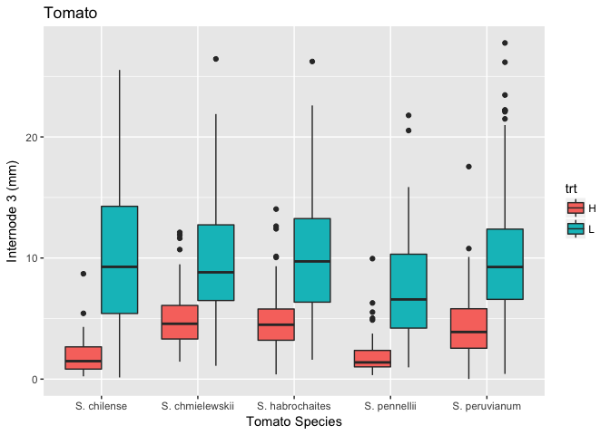<!-- -->

* save your plot to another file:  
R will figure out the appropriate file type from the file extension (pdf, png, jpg, tif)

```r
ggsave("~/Desktop/Internode3.pdf", height=6, width = 6)
```

```
## Warning: Removed 4 rows containing non-finite values (stat_boxplot).
```

